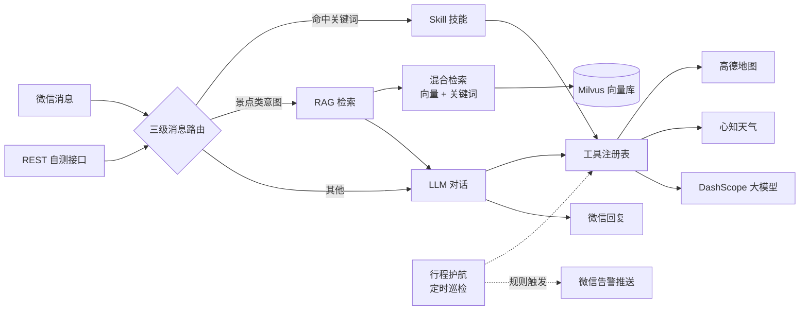

# wechat-link

[](https://openjdk.org/)
[](https://spring.io/projects/spring-boot)
[](https://maven.apache.org/)

> 微信机器人项目：自动收发消息，接入阿里云百炼（DashScope）大模型，支持联网搜索、Function Calling 工具调用、Skill 技能框架、景点指南 RAG 检索与行程护航定时告警。

## ✨ 功能亮点

| 功能 | 说明 |
| --- | --- |
| 微信自动回复 | 扫码登录、登录态持久化；接收文本与已转写语音，自动调用 LLM 回复 |
| 三级消息路由 | Skill 关键词命中 → RAG 景点问答 → LLM 对话（联网搜索兜底） |
| Function Calling | 模型自动调用已注册工具，支持一轮多工具并行 / 串行执行 |
| 内置工具 | 天气、POI 搜索、景点查询、实时路况、出行路线、距离矩阵、景点指南 RAG 问答 |
| 出行推荐 | 综合距离、城市地铁、高峰时段与用户偏好推荐交通方式 |
| 旅行规划 | 生成结构化行程单（含状态与预算明细），支持「重新排」重规划 |
| 行程护航 | 定时巡检 + LLM 触发判断，规则命中时微信主动推送告警 |
| 多轮记忆 | 按用户保留最近 10 条消息作为 LLM 上下文 |
| 状态持久化 | 监控列表与行程单保存到 `~/.autotrip-state.json`，重启自动恢复 |

## 🚀 快速开始

### 环境要求

- JDK 21
- Maven 3.9+（也可以使用项目自带的 Maven Wrapper）
- 可访问外网（调用阿里云百炼、心知天气、高德地图和微信 SDK 服务）
- （可选）Milvus 2.4.x，用于景点指南 RAG 检索；不可用时自动降级为关键词检索

### 配置环境变量

启动前需要配置三个 API Key：

```powershell
setx DASHSCOPE_API_KEY "你的阿里云百炼密钥"
setx WEATHER_API_KEY "你的心知天气密钥"
setx AMAP_API_KEY "你的高德 Web 服务密钥"
```

`setx` 设置的变量需要新开一个终端才会生效。只想在当前终端临时使用，可以改为 `$env:DASHSCOPE_API_KEY = "..."`。

- `DASHSCOPE_API_KEY`：[阿里云百炼控制台](https://bailian.console.aliyun.com/)
- `WEATHER_API_KEY`：[心知天气控制台](https://www.seniverse.com/)
- `AMAP_API_KEY`：[高德开放平台](https://console.amap.com/)

> 密钥只放到环境变量或本地配置文件里，不要提交到 Git。

### 启动项目

```powershell
mvn spring-boot:run
```

也可以使用项目自带的 Maven Wrapper：

```powershell
.\mvnw.cmd spring-boot:run
```

项目默认监听 `http://localhost:8080`。

### 扫码登录

1. 打开 `GET http://localhost:8080/wechat/qrcode`，返回微信登录二维码链接。
2. 用测试微信号扫码登录。若此前登录态仍有效，启动时不会再次扫码。
3. 扫码成功后，微信机器人开始自动接收消息并回复。

常用 REST 接口：

| 方法 | 路径 | 说明 |
| --- | --- | --- |
| `GET` | `/wechat/qrcode` | 获取微信登录二维码 |
| `GET` | `/wechat/status` | 查看登录 / 连接状态 |
| `POST` | `/wechat/poll` | 手动拉取一次消息 |
| `POST` | `/wechat/send` | 主动发送文本，请求体 `{"toUserId":"...", "text":"..."}` |
| `GET` | `/wechat/messages` | 查看最近收到的消息（内存中最多 100 条） |
| `POST` | `/wechat/llm/chat` | 不登录微信也能测试 LLM，请求体 `{"text":"郑州天气怎么样"}` |

## 🏗️ 整体架构



消息处理流程：

```text
微信消息（文本 / 已转写文字的语音）
  └─ chatOrGenerate()
     ├─ ① 命中 Skill 关键词 → 执行技能并直接返回
     ├─ ② 命中 RAG 关键词（大理/杭州/上海/长沙 + 景点类意图）→ 增强 Prompt → LLM 回复
     └─ ③ 都没命中 → LLM 多轮工具调用（未调用工具时联网搜索兜底）→ 返回最终回复
```

## 🛠️ 内置工具

| 工具名 | 功能 |
| --- | --- |
| `query_weather` / `query_weather_forecast` | 实时天气 / 未来 1-15 天预报，默认 3 天 |
| `search_poi` | 搜索餐厅、酒店、景点、商场等地点 |
| `query_attractions` / `query_attraction_detail` | 城市景点列表 / 景点评分、开放时间等详情 |
| `query_traffic` | 某城市某道路的实时拥堵情况（基于免费驾车路线接口的通行速度估算） |
| `query_route` | 两地间步行、公交、地铁、驾车、高铁方案并给出推荐 |
| `query_distance_matrix` | 一次计算一个起点到多个目的地的距离和耗时 |
| `query_guide_rag` | 大理/杭州/上海/长沙景点指南 RAG 问答（带来源） |

工具会由模型通过 Function Calling 自动调用，也能被 Skill 主动调用。完整参数说明与新增工具方法见 [docs/tool-development.md](docs/tool-development.md)。

## ⚙️ 配置说明

配置集中在 `src/main/resources/application.properties`：

| 配置项 | 默认值 | 说明 |
| --- | --- | --- |
| `dashscope.api-key` | `${DASHSCOPE_API_KEY:}` | 阿里云百炼 API Key |
| `weather.api-key` | `${WEATHER_API_KEY:}` | 心知天气 API Key |
| `amap.api-key` | `${AMAP_API_KEY:}` | 高德开放平台 Web 服务 API Key |
| `dashscope.chat-model` | `qwen-plus` | 对话模型 |
| `dashscope.tool-execution-mode` | `parallel` | 工具执行模式：`serial` 或 `parallel` |
| `dashscope.tool-execution-threads` | `4` | 并行模式下工具执行线程数 |
| `dashscope.tool-execution-max-rounds` | `12` | 单次消息最多工具调用轮数 |
| `dashscope.enable-search` | `true` | 是否开启联网搜索兜底 |
| `dashscope.forced-search` | `true` | 命中实时类关键词后是否强制搜索 |
| `dashscope.search-extension` | `true` | 是否启用垂域搜索 |
| `rag.embedding.model` | `text-embedding-v3` | RAG 嵌入模型（API Key 复用 `DASHSCOPE_API_KEY`） |
| `rag.embedding.dimensions` | `1024` | 嵌入向量维度（需与 Milvus 集合一致） |
| `rag.milvus.host` / `rag.milvus.port` | `localhost` / `19530` | Milvus 向量库连接地址 |
| `rag.milvus.collection` | `trip_guide_chunks` | Milvus 集合名 |
| `rag.retrieve.candidates` / `rag.retrieve.top-k` | `20` / `5` | 每路召回候选数 / 重排后进入 Prompt 的知识块数 |
| `rag.rerank.model` | `gte-rerank-v2` | 重排模型，调用失败自动降级本地规则重排 |
| `rag.index.auto-build` | `true` | 启动时自动构建索引 |
| `monitor.enabled` | `true` | 是否开启行程护航定时巡检 |
| `monitor.check-interval-minutes` | `1` | 行程护航巡检间隔（分钟，演示用；长期运行建议调大） |
| `app.state-file` | `${user.home}/.autotrip-state.json` | 监控列表与行程单的持久化文件 |
| `agent.memory-size` | `10` | 每个用户保留的最近对话条数（仅内存） |
| `wechat.auto-login` | `true` | 启动时自动恢复登录态或打印二维码 |
| `wechat.resume-file` | `${user.home}/.wechat-demo-resume.json` | 微信登录态保存位置 |
| `logging.charset.console` | `UTF-8` | 控制台日志编码 |

## ⚠️ 使用注意事项

- 未配置 `DASHSCOPE_API_KEY` 时，LLM 调用会报「未配置阿里云百炼 API Key」；未配置 `WEATHER_API_KEY` 时天气工具会执行失败；未配置 `AMAP_API_KEY` 时 POI、景点、路况、路线、距离矩阵工具会执行失败。
- 天气工具只支持具体城市（如「郑州」「上海」或拼音 `zhengzhou`），不支持省份等省级区域；地点搜索建议携带城市，未提供城市时可能在全国范围搜索。
- 多轮对话记忆仅保存在内存中（每用户最近 10 条），重启后清空。
- 微信语音消息依赖服务端把语音转成文字；如果 SDK 未返回转写文字，则不会回复。
- `/wechat/send` 只能给「曾经给 bot 发过消息且已被 SDK 拉取过会话上下文」的用户发送，否则会缺少 contextToken。
- 微信登录态保存在 `~/.wechat-demo-resume.json`，包含会话凭据，不要提交或分享；登录态失效时会自动删除并重新扫码。
- 消息回复是单线程顺序处理的，LLM 较慢时新消息会排队等待。
- 工具默认并行执行，多工具同时调用外部接口时要注意第三方 API 限流；需要严格串行时可改为 `serial`。
- 高德 Web 服务有并发和每日配额限制，代码内已限制最多 2 个并发请求并在限流时重试一次，但高频使用仍可能触发配额耗尽。
- 实时路况为估算值：改用免费的地理编码 + 驾车路线接口，按走廊通行速度推算拥堵等级，并非官方拥堵指数。
- RAG 检索依赖本机 Milvus 容器（`localhost:19530`）和 `DASHSCOPE_API_KEY`；Milvus 不可用或嵌入失败时自动降级为纯关键词检索，不影响其他功能。
- 启动时会自动重建 RAG 索引（清洗 → 切分 → 向量化 → 写入 Milvus，40 个景点一般十几秒完成）。
- 每条监控每次巡检消耗 1 次工具调用 + 1 次 LLM 判断，当前默认 1 分钟一轮仅用于演示，长期运行建议调回 30 分钟以节省费用；规则解析不出结果时按不触发处理。
- 预算类监控需要先有行程单（发送「帮我规划三天杭州行程」生成）；天气监控只支持具体城市；路况监控注册时请写成「城市 道路」格式。
- 联网搜索和模型调用会产生 API 费用，长时间运行或高频测试前先确认额度。
- REST 接口没有鉴权，只适合本机或内网开发调试，不要直接暴露到公网。
- Windows 控制台中文乱码时，可用 Windows Terminal，或在启动前执行 `chcp 65001`。

## 🧪 测试

```powershell
mvn test
```

使用 Maven Wrapper 时执行：

```powershell
.\mvnw.cmd test
```

当前 69 个测试用例全部通过，覆盖工具执行、路况、交通推荐、RAG 检索、行程护航与行程规划，不需要真实 API Key。

## 📁 项目结构

```text
src/main/java/com/group/autotrip/
├── DemoApplication.java         Spring Boot 启动类
├── agent/
│   ├── DashScopeService.java    LLM 对话、三级路由（Skill → RAG → LLM）、工具调用多轮闭环
│   ├── ConversationMemory.java  多轮对话记忆（内存，按用户）
│   ├── MonitorService.java      行程护航：监控注册表、定时巡检、LLM 触发判断、微信告警推送
│   ├── TripPlanStore.java       按用户保存最新行程单
│   └── StateStore.java          监控列表与行程单的本地 JSON 持久化
├── common/
│   ├── FunctionTool.java        工具接口
│   └── model/                   Route / Itinerary / DayPlan / Spot / RouteOption / TransportMode
├── output/
│   └── ItineraryOutput.java     行程单成品排版（从 Itinerary 渲染）
├── rag/
│   ├── RagService.java          RAG 问答编排（query 向量化 → 混合检索 → 重排 → Prompt → LLM）
│   ├── RagIndexer.java          建库编排（清洗 → 切分 → 向量化 → Milvus / VSM 索引）
│   ├── RagKnowledgeTool.java    景点指南 RAG 工具（query_guide_rag）
│   ├── RagController.java       调试接口 /rag/status、/rag/reindex、/rag/ask
│   ├── ingest/                  GuideDataLoader / GuideCleaner / GuideChunker（知识源加载、清洗、切分）
│   ├── embed/                   DashScopeEmbeddingClient（阿里云嵌入客户端）
│   ├── store/                   MilvusVectorStore / VsmKeywordIndex（向量库 + 内存 VSM 关键词索引）
│   ├── retrieve/                HybridRetriever / Reranker / RagPromptBuilder（混合检索、重排、Prompt）
│   └── model/                   知识块等数据结构
├── skill/
│   ├── Skill.java               Skill 接口
│   ├── SkillContext.java        Skill 执行上下文
│   ├── SkillRegistry.java       Skill 注册表
│   ├── SkillDispatcher.java     Skill 关键词调度器
│   ├── TripGuardSkill.java      行程护航技能（注册/查看/取消监控）
│   └── TripPlanSkill.java       旅行规划技能（结构化行程单 + 重规划）
├── tools/
│   ├── CustomTools.java         工具注册与分发
│   ├── QueryWeatherTool.java    天气查询工具
│   ├── QueryWeatherForecastTool.java  天气预报工具
│   ├── WeatherService.java      心知天气 HTTP 服务
│   ├── AmapService.java         高德 Web API 封装
│   ├── SearchPoiTool.java       地点搜索工具
│   ├── QueryAttractionsTool.java 景点列表工具
│   ├── QueryAttractionDetailTool.java 景点详情工具
│   ├── QueryTrafficTool.java    实时路况工具
│   ├── QueryRouteTool.java      出行路线工具
│   ├── QueryDistanceMatrixTool.java 距离矩阵工具
│   ├── CityTransportSupport.java 城市交通档案
│   └── TransportRecommender.java 出行方式推荐
└── wechat/
    ├── WeChatController.java    微信 REST 接口
    ├── WeChatService.java       微信登录、收发消息、自动回复
    └── ...                      消息与登录态相关数据结构

src/main/resources/
├── application.properties       全部配置项
├── cities-transport.json        城市地铁 / 铁路能力与 adcode 档案
└── guides/                      大理 / 杭州 / 上海 / 长沙景点指南（RAG 知识源）
```

## 📚 开发文档

- [新增工具](docs/tool-development.md)：实现 `FunctionTool` 接口即可自动注册，无需改动公共代码。
- [新增 Skill](docs/skill-development.md)：实现 `Skill` 接口，支持在技能内调用工具与 LLM。

欢迎提交 Issue 与 Pull Request；开发新功能前建议先阅读上述指南。
